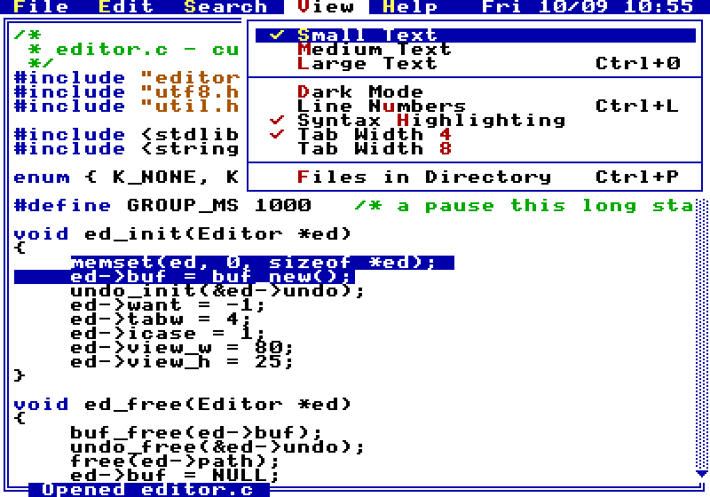
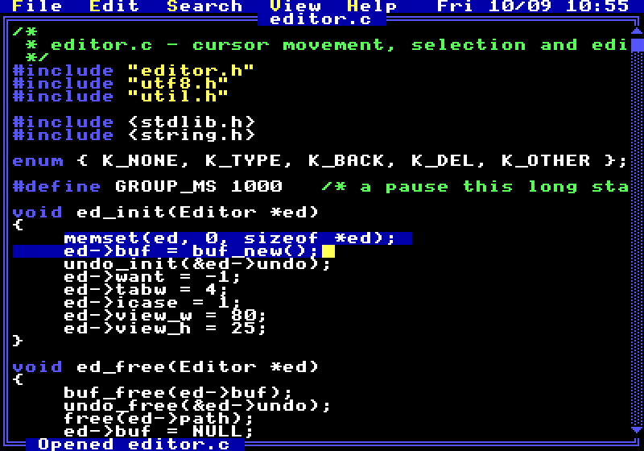

# cedit — Classic Text Editor

A small, fast text editor with the look and feel of an 80s/90s text-mode
editor, inspired by TempleOS and MS-DOS EDIT. It has a menu bar, a
double-line window frame, a blinking block cursor, the 16-color VGA palette,
and fonts and mouse pointers drawn by hand.

<p>
  
  
</p>

- **Modeless and simple:** you just type. Commands use the familiar `Ctrl`
  shortcuts and a menu bar you can drive with the mouse or the keyboard.
- **Fast on huge files:** files are memory-mapped and indexed in the
  background. The first screen of a 1 GB file shows up in under a
  millisecond, the whole file is indexed in about 0.1 s, and editing stays
  instant.
- **C89 + SDL2** and nothing else.

## Build

Requirements: `clang` (or any C89 compiler, see below), `make`, and SDL2
development files (`sdl2-config` must be on your `PATH`).

```sh
make -j         # builds build/cedit
make check      # builds and runs the buffer/undo/editor/syntax tests in build/
make tools      # builds the review tools (build/fontsheet, build/uishot)
make compdb     # regenerates build/compile_commands.json with bear
make install    # installs to /usr/local/bin (PREFIX=... to change)
make clean      # removes the build outputs
```

Everything is built into `build/`, with object files in `build/obj/`.

**Compiler.** The Makefile uses clang because it builds this tree about 1.5×
faster than gcc. These are full builds of the editor, tests and tools, median
of 5 runs with clang 22.1 and gcc 16.2:

| | clean build `-j1` | clean build `-j16` | rebuild after editing `ui.c` |
|---|---|---|---|
| clang | 2.61 s | 0.77 s | 0.65 s |
| gcc | 3.81 s | 1.23 s | 1.08 s |

`make CC=gcc` still works, and the code builds without warnings under both
with `-std=c89 -pedantic -Wall -Wextra`. The one hot loop that depended on the
compiler, newline counting during load, is written so that both vectorize it
(about 20 ms/GB with either).

**Editor setup.** `make compdb` records every compile command with
[bear](https://github.com/rizsotto/Bear) into `build/compile_commands.json`.
clangd picks it up from `build/` on its own, and VSCode's C/C++ extension uses
it through `.vscode/c_cpp_properties.json`. Run `make compdb` once after
cloning, and again when files or flags change.

## Usage

```sh
cedit [file]
```

If the file doesn't exist, cedit opens an empty buffer and creates the file
on the first save. You can also drop a file onto the window to open it.

### Settings

Settings are changed from the menus and remembered across sessions in
`~/.config/cedit/cedit.conf` (or `$XDG_CONFIG_HOME/cedit/cedit.conf`; set
`CEDIT_CONFIG` to use a different file, or to an empty value to disable it).

| Setting | Menu | Default |
|---|---|---|
| Text size | View → Small / Medium / Large Text | Large |
| Dark mode | View → Dark Mode | off |
| Line numbers | View → Line Numbers | off |
| Tab width | View → Tab Width 4 / 8 | 4 |
| Auto indent (Enter copies the line's leading whitespace) | Edit → Auto Indent | off |
| Syntax highlighting | View → Syntax Highlighting | on |

### Keys

| Keys | Action |
|---|---|
| `Ctrl+N` / `Ctrl+O` / `Ctrl+S` / `Ctrl+Shift+S` | New / Open / Save / Save As |
| `Ctrl+Q` | Exit (asks to save unsaved changes) |
| `Ctrl+Z` / `Ctrl+Y` (or `Ctrl+Shift+Z`) | Undo / Redo |
| `Ctrl+X` / `Ctrl+C` / `Ctrl+V` | Cut / Copy / Paste (system clipboard) |
| `Ctrl+A` | Select all |
| `Shift` + movement, mouse drag | Select (double-click: word, triple-click: line) |
| Right-click, `Menu` key or `Shift+F10` | Context menu (Undo, Cut, Copy, Paste, Delete, Select All) |
| `Ctrl+P` (View → Files in Directory) | Pop up the folders and files in the current file's directory and open one. `Right` / `Left` open and close folders |
| `Ctrl+Left` / `Ctrl+Right` | Previous / next word |
| `Ctrl+Up` / `Ctrl+Down` | Scroll without moving the cursor |
| `Home` / `End`, `Ctrl+Home` / `Ctrl+End` | Line start (smart) / end, file start / end |
| `Ctrl+Backspace` / `Ctrl+Del` | Delete word |
| `Tab` / `Shift+Tab` | Insert tab, or indent / unindent the selected lines |
| `Ins` | Toggle insert / overwrite mode (hollow red cursor) |
| `Ctrl+F`, `F3` / `Shift+F3` | Find, next / previous match |
| `Ctrl+H` | Replace (one at a time, or all at once) |
| `Ctrl+G` | Go to line |
| `Ctrl+-` / `Ctrl+=`, `Ctrl+wheel` | Smaller / larger text |
| `Ctrl+0` | Default (large) text |
| `Ctrl+L` | Line numbers |
| `F10` or tap `Alt`, `Alt+letter` | Menu bar |
| `F1` | Keyboard help |

## Design

| File | What it does |
|---|---|
| `src/buffer.c` | Text storage: a B-tree of line-aligned leaves in the style of Vim's memline, memory-mapped copy-on-write loading, incremental indexing, atomic save |
| `src/undo.c` | Linear undo/redo of byte-level insert/delete ops, grouped into steps |
| `src/editor.c` | Cursor, selection, edit commands, search/replace. No SDL code |
| `src/screen.c` | A text-mode cell grid with box and label drawing. Only changed cells are rasterized, and the image is scaled up by integer factors |
| `src/ui.c` | The application: commands, the concrete dialogs, the editor window, input handling |
| `src/menu.c` | The menu tables (every command with its label and shortcut), menu drawing and navigation, and the scrolling tree menu for files |
| `src/dialog.c` | Generic dialog boxes: labels, input fields, checkboxes, buttons and a list box |
| `src/theme.c` | The light and dark color themes |
| `src/syntax.c` | Syntax highlighting: the rule-driven lexer, language detection, and the cache of lexer states at line starts |
| `src/langs.c` | The language definitions: rules and word lists for each language |
| `src/font8x8.c`, `src/font20x20.c` | The hand-drawn "Temple" font at 8×8 and 20×20, as ASCII art |
| `src/font.c` | Builds the glyph tables: box drawing from stroke rules, accented Latin-1 letters by composition |
| `src/cursor.c` | Hand-drawn mouse pointers (the TempleOS arrow, I-beam, hourglass) and text cursor shapes |
| `src/config.c` | Loads and saves the settings file, driven by one table of keys |
| `src/util.c` | Allocation and string helpers shared by all modules |

### Extending

- **A command:** add a `CMD_` value in `src/menu.h` and a row in a menu
  table in `src/menu.c`, then handle it in `command()` in `src/ui.c` (and in
  `cmd_enabled()` / `cmd_checked()` if it can be disabled or toggled). Its
  keyboard shortcut goes in `editor_key()`.
- **A dialog:** build it in `src/ui.c` from the widgets in `src/dialog.h`,
  and act on its buttons in `dialog_button()`.
- **A setting:** add a field to `Config` in `src/config.h`, with a default
  and a row in the key table in `src/config.c`.
- **A language:** write its rules and word lists in `src/langs.c` and add a
  row to `syn_langs` with its file extensions or names (and the
  interpreters a `#!` line may name). The rule kinds and flags are described
  in `src/syntax.h`. A language the rules can't describe can bring its own
  lexer function instead.
- **A highlight color:** the lexer tells keywords, types, comments, strings,
  numbers and preprocessor directives apart; each theme maps them to colors
  in its `hl` row in `src/theme.c`.

### Text sizes

All sizes use the "Temple" font, drawn after TempleOS's 8×8 font. Like
TempleOS's, its letters fill the cell with no gap between lines, so a
screen holds many lines for the size of the letters.

- **Small:** the 8×8 font doubled (16 px lines)
- **Medium:** the same design redrawn at 2.5× as a 20×20 font (20 px
  lines), which matches TempleOS full screen on a 1200-pixel-tall display
- **Large** (the default): the 8×8 font tripled (24 px lines)

All three are multiplied by the display's HiDPI factor, so the pixels stay
crisp and square.

The window can't be made smaller than 20×8 cells of the chosen size. A
window manager that sizes it smaller anyway (a tiling one, say) gets the
next smaller size that fits, until the window is big enough again.

### Character set

Files are edited as UTF-8, and any bytes, valid or not, are saved back
unchanged. The fonts cover ASCII, Latin-1, typographic quotes and dashes, `€`,
arrows, and box-drawing and block characters. Other characters show as a red
placeholder box, and control characters show as an inverse `^X` letter. Files
with DOS (CRLF) line endings stay CRLF.

### Mouse pointer

cedit draws its pointer itself, on top of its own frame, at about the pixel
size of the font. The system pointer is hidden while the mouse is over the
window. Pointer images handed to the OS get resized by the compositor at
fractional display scales (such as 1.25×), which blurs pixel art; drawing it
ourselves keeps it exactly as sharp as the text. The trade-offs are about one
frame of pointer lag, and that OS pointer size and accessibility settings
don't apply inside the window.

### Syntax highlighting

Keywords and types are blue, comments green and strings brown, as in
TempleOS (brighter versions of these in dark mode). The language is picked
from the file name when a file is opened or saved, or else from a `#!` first
line:

C, C++, Python, Shell, Makefile, JavaScript, TypeScript, JSON, Go, Rust, Lua
and Markdown.

Each language is a list of rules: comments to the end of the line, spans
from an opening to a closing delimiter (which may run over several lines,
nest, or need a matching count as in Lua's `[==[ ]==]`), directives such as
`#include`, and word lists. The lexer goes a line at a time, carrying what is
still open at a line's end into the next. Its state at the start of every
128th line is cached and dropped from the first line an edit changes, so a
screen only needs lexing from the nearest cached state.

On huge files the lexer runs in the background like the indexing (about
280 MB/s). Until it reaches a line far from the start, such as the end of a
1 GB file right after opening it, that part is lexed from a few hundred lines
up as if nothing were open there. It's recolored once the background pass
catches up.

### Themes

Light mode is TempleOS's black ink on white paper. Dark mode is white on
black with the same blue bars and yellow block cursor. Both use the 16-color
VGA palette, with each UI element mapped to a palette color through a theme
table in `src/theme.c`.

### Review tools

```sh
make tools
build/fontsheet 8 4 sheet.ppm             # render a font sample sheet (8 or 20)
SDL_VIDEODRIVER=offscreen build/uishot shot file.txt k:F10 s
                                          # drive the UI headlessly, save screenshots
                                          # (tokens are listed in tests/uishot.c)
```

`uishot` never reads or writes your settings file.

## Limitations

See [`limitations.md`](limitations.md) for what cedit doesn't do yet compared
to what you might expect from a text editor.
